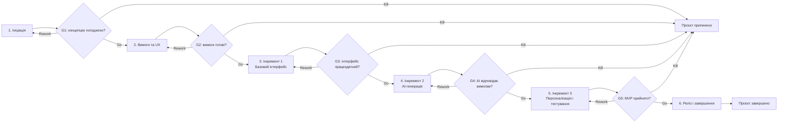

# Життєвий цикл проєкту FridgeChef UA

## 1. Обрана модель життєвого циклу

**Конкретна модель:** інкрементна модель.

**Тип за сучасною класифікацією:** інкрементальний життєвий цикл (Incremental).

Інкрементна модель підходить FridgeChef UA, оскільки продукт можна створювати завершеними функціональними частинами та демонструвати результат після кожного етапу. Спочатку команда реалізує базовий інтерфейс і роботу з інгредієнтами, потім додає AI-генерацію рецептів, а після цього — профіль, дієтичні параметри, улюблені рецепти й поширення. Такий підхід дає змогу рано перевірити основний користувацький сценарій, отримати зворотний зв’язок і не витрачати обмежені ресурси на другорядні функції до підтвердження цінності MVP.

## 2. Фази життєвого циклу

| № | Назва фази | Мета фази | Тривалість | Ключові роботи | Deliverables | Відповідальний |
|---|---|---|---|---|---|---|
| 1 | Ініціація та формування концепції | Узгодити проблему, цільову аудиторію, межі продукту й очікувану цінність MVP. | 1 тиждень | Формування команди; розподіл ролей; опис проблеми, аудиторії та функцій; визначення обмежень і припущень. | `project-brief.md`; `project-classification.md`; погоджена концепція MVP. | Кумановський Артур — Product Owner / Project Manager; Пронь Сергій — Analyst. |
| 2 | Аналіз вимог і UX-проєктування | Перетворити концепцію на перевірювані вимоги та зрозумілий користувацький сценарій. | 1 тиждень | Уточнення функціональних і нефункціональних вимог; формування backlog; опис сценарію генерації рецепта; підготовка структури екранів; визначення критеріїв приймання. | Backlog MVP; перелік вимог; прототип основних екранів; критерії приймання. | Пронь Сергій — Analyst; уся команда — UX-рішення. |
| 3 | Інкремент 1 — базовий вебінтерфейс | Створити працездатну оболонку застосунку без залежності від AI-сервісу. | 2 тижні | Налаштування React, TypeScript і Vite; створення адаптивного інтерфейсу; введення та видалення інгредієнтів; вибір кухні, часу й режиму використання продуктів; відображення тестових карток. | Працездатний інтерфейс; форма параметрів; тестовий набір рецептів; результати первинної UX-перевірки. | Загородній Дмитро — Developer; уся команда — тестування. |
| 4 | Інкремент 2 — AI-генерація рецептів | Реалізувати основну цінність продукту — персоналізовані рецепти українською мовою. | 2 тижні | Інтеграція Gemini API; формування prompt; отримання структурованої відповіді; показ інгредієнтів, інструкцій і КБЖУ; генерація зображень; обробка помилок і лімітів API. | Інтегрований AI-сервіс; генерація добірки рецептів; детальна картка страви; повідомлення про помилки. | Загородній Дмитро — Developer; Пронь Сергій — перевірка вимог і результатів. |
| 5 | Інкремент 3 — персоналізація та стабілізація | Додати користувацькі функції й підтвердити стабільність повного сценарію MVP. | 1 тиждень | Реалізація профілю, дієти й алергій; збереження улюблених рецептів; сортування та поширення; функціональне, UX- і негативне тестування; виправлення критичних дефектів. | Профіль користувача; список улюблених; завершений набір функцій MVP; протокол тестування; перелік відомих обмежень. | Уся команда; Загородній Дмитро — виправлення; Пронь Сергій — тестування; Кумановський Артур — приймання. |
| 6 | Реліз і завершення | Підготувати стабільну демонстраційну версію та закрити навчальний проєкт. | 1 тиждень | Фінальна перевірка критеріїв приймання; підготовка README і демонстраційних матеріалів; перевірка репозиторію; презентація результату; фіксація підсумків і наступних кроків. | Демонстраційний MVP; актуальна документація; фінальний commit або release; презентація; підсумковий висновок. | Кумановський Артур — Product Owner / Project Manager; уся команда — демонстрація. |

**Загальна тривалість:** 8 тижнів.

## 3. Ворота між фазами

| Ворота | Перехід між фазами | Критерії переходу | Можливі рішення |
|---|---|---|---|
| G1 | Ініціація → Аналіз вимог і UX | Проблему й цільову аудиторію описано; межі MVP зафіксовано; ролі та відповідальність визначено; основні обмеження і припущення погоджено. | **Go** — перейти до вимог; **Rework** — уточнити концепцію; **Kill** — припинити проєкт, якщо проблема не підтверджена або тема не погоджена. |
| G2 | Аналіз вимог і UX → Інкремент 1 | Backlog має пріоритети; основні екрани й користувацький сценарій описано; кожна обов’язкова функція має критерії приймання; команда підтвердила реалістичність плану. | **Go** — почати розробку; **Rework** — скоротити або деталізувати вимоги; **Kill** — припинити, якщо MVP неможливо реалізувати наявними ресурсами. |
| G3 | Інкремент 1 → Інкремент 2 | Застосунок запускається; форма приймає інгредієнти та параметри; інтерфейс адаптується до мобільного екрана; тестові рецепти відображаються без критичних дефектів. | **Go** — інтегрувати AI; **Rework** — виправити інтерфейс або базову логіку; **Kill** — припинити, якщо обраний технічний підхід не працює. |
| G4 | Інкремент 2 → Інкремент 3 | Gemini API повертає валідну структуру; рецепти генеруються українською; картка містить усі обов’язкові поля; помилки й перевищення ліміту обробляються без аварійного завершення застосунку. | **Go** — додати персоналізацію; **Rework** — виправити prompt, валідацію чи інтеграцію; **Kill** — вилучити або замінити AI-функцію, якщо зовнішній сервіс непридатний. |
| G5 | Інкремент 3 → Реліз і завершення | Наскрізний сценарій проходить успішно; немає критичних дефектів; профіль і улюблені працюють; відомі обмеження задокументовано; Product Owner прийняв MVP. | **Go** — випустити демонстраційну версію; **Rework** — виправити критичні проблеми; **Kill** — не випускати версію, якщо вона небезпечна або не демонструє цінність продукту. |

## 4. Візуалізація життєвого циклу

## 5. Обґрунтування вибору моделі

Вибір інкрементної моделі зумовлений малим розміром команди, обмеженим навчальним строком і можливістю розділити продукт на самодостатні функціональні частини. Найризикованішою складовою є інтеграція AI, тому до її реалізації команда спочатку створює та перевіряє базовий інтерфейс. Це зменшує кількість одночасних невідомих і дає видимий результат уже після третьої фази.

Команда також розглядала каскадну модель, прототипування та гнучку Agile-модель. Каскадна модель була відхилена через потребу уточнювати вимоги після перевірки AI-відповідей і UX. Чисте прототипування не забезпечує достатньо чіткої послідовності переходу до завершеного MVP, а повний Scrum-процес створив би зайве організаційне навантаження для трьох учасників і короткого навчального проєкту.

Перевагами інкрементної моделі є рання демонстрація результатів, можливість окремо тестувати кожну частину, прозорий контроль обсягу та простіше визначення пріоритетів. Якщо строк скорочується, команда може випустити базовий продукт із перших двох інкрементів і перенести частину персоналізації до наступної версії, не втративши основної цінності генератора рецептів.

Основні ризики моделі — накопичення технічного боргу між інкрементами, несумісність нових функцій із попередньою реалізацією, затримка AI-інтеграції та надмірне розширення обсягу. Для їх мінімізації використовуються єдиний backlog, критерії приймання, контрольні ворота, перевірка повного сценарію після кожного інкременту, фіксація відомих обмежень і право Product Owner відкладати другорядні функції заради стабільності MVP.
